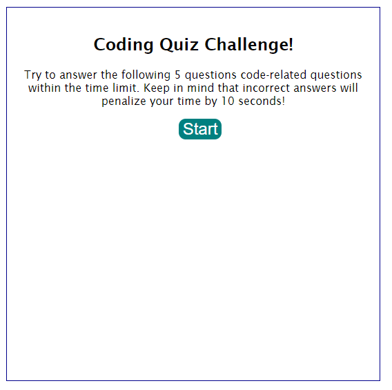
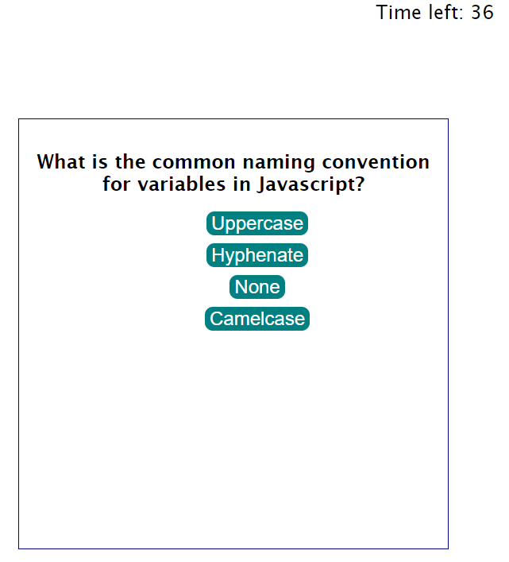
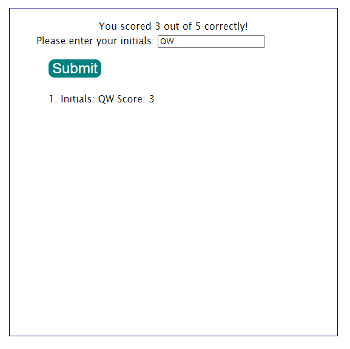

# 04-javascript-code-quiz

## Description

This application was built to create a timed coding quiz with multiple choice questions for the user to test their coding knowledge.   The application was created to to practice creating a dynamically updated HTML and CSS powered by JavaScript code.  

Once the user opens the application, they are given 60 seconds to answer 5 questions based on coding.  For every wrong answer, they lose 10 seconds from their time. The game ends once they've answered all 5 questions to their best of their ability or until time runs out, which ever comes first.

At the end, they are invited to submit their initials & final score for the High Scores tracking. 

Skills learned:  
- listening for keyboard events
- storage & retrieval of information to local storage
- setting variables that navigate the DOM via accessing elementsById, querySelector 
- furthered function creation & knowledge
- furthered experience with HTML & CSS 

## Installation

None necessary, it can be accessed via GitHub at [RKML14's Deployed GitHub repo](https://rkml14.github.io/04-javascript-code-quiz/)

## Usage

Click start to begin the quiz!

Example of a question from the quiz, click the button to choose the correct answer.  Time left is displayed in the upper right corner.

Submit user initials for the high score list:

## Thank you

A special thanks to Dominique Meeks Gombe for her amazing tutoring!  

## Author

Rebecca Lawrence  
[GitHub Profile](https://github.com/rkml14/04-javascript-code-quiz)
